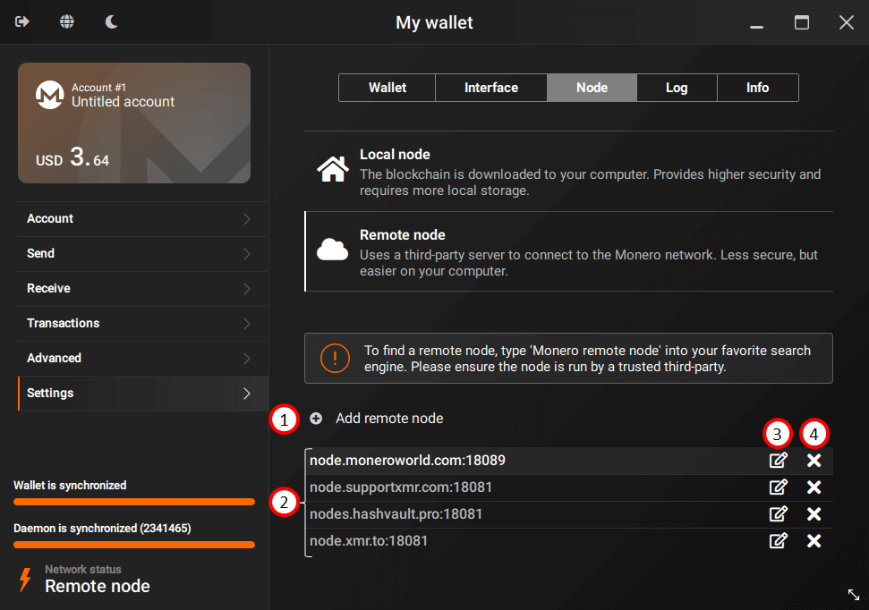

# Settings

The `Settings` tab provides tools for customizing configuration options.

### Wallet

### Local Node

**(1) Start/Stop Local Node:** Depending on its current state, either start or stop the local node.    
**(2) Blockchain location:** Manually enter a non-default path to the blockchain.    
**(3) Startup flags:** When using a local node, this will be where you enter additional command line options.    
**(4) Bootstrap Address:** Enter the hostname or IP address of the bootstrap remote node. See section [8.1 Bootstrap nodes](#8.1-bootstrap-nodes) for a brief explanation of what is a bootstrap node.    
**(5) Bootstrap Port:** Enter the port of the bootstrap remote node.

### Remote Node

Use a remote node, do not download the blockchain. Check the ['About remote nodes' section](#8-about-remote-nodes) of this guide.

**(1) Address:** Enter the hostname or IP address of the remote node.    
**(2) Port:** Enter the port of the remote node.    
**(3) Daemon Username:**  enter a username in case authentication to the remote node is required.    
**(4) Daemon Password:**  enter a password in case authentication to the remote node is required.

### Log

**(1) Log level:** Change the verbosity of the debug logs.    
**(2) Log categories:** Add specific categories to the debug logs.    
**(3) Daemon log:** Real time output of the log.    
**(4) Command line:** Interact with the daemon.

### Info

**(1) GUI Version:** Version of the GUI wallet installed.    
**(2) Embedded Monero Version:** Version of the embedded daemon in use.    
**(3) Wallet path:** Where the wallet is located on your computer.    
**(4) Wallet creation height:** Change the block height that a wallet rescan will go back to.    
**(5) Wallet log path:** Where the logs for this wallet will be saved.    
**(6) Copy to clipboard:** Copy all these informations to the clipboard.    

## Seed and keys

The `Seeds & Keys` tab displays your wallets mnemonic seed as well as your secret view key, public view key, secret spend key, and public spend key.

**(1) Mnemonic seed: DO NOT share your mnemonic seed with anyone. Store a copy securely.** The mnemonic seed is a 25 word phrase that contains all the information needed to view and spend funds. *Learn more about [mnemonic seeds](https://getmonero.org/resources/moneropedia/mnemonicseed.html).*    
**(2) Secret view key:** Secret view keys allows the holder to view your wallets incoming transactions, but not outgoing. It is sometimes useful for auditing purposes to give your secret view key to a third party.    
**(3) Public view key:** The public view key is used for stealth address creation. *Learn more about [view keys](https://getmonero.org/resources/moneropedia/viewkey.html).*    
**(4) Secret spend key: DO NOT share your secret spend key with anyone. The secret spend key is used to sign transactions and should be regarded with the same security as your mnemonic seed.**    
**(5) Public spend key:** The public spend key is used by the network to verify the signature of the key image you generate when you make a transaction. This is what prevents double-spends as the network enforces the rule that a key image can be spent only once. *Learn more about [spend keys](https://getmonero.org/resources/moneropedia/spendkey.html).*    
**(6) Export Spendable Wallet: DO NOT share your spendable wallet QR code with anyone. This can be used like a mnemonic seed for recovering your wallet.** This creates a qrcode that contains all of your keys.    
**(7) Export View Only Wallet:** This creates a QR code that contains only the keys for viewing the transactions that this wallet sends or receives, but cannot create transactions.    

